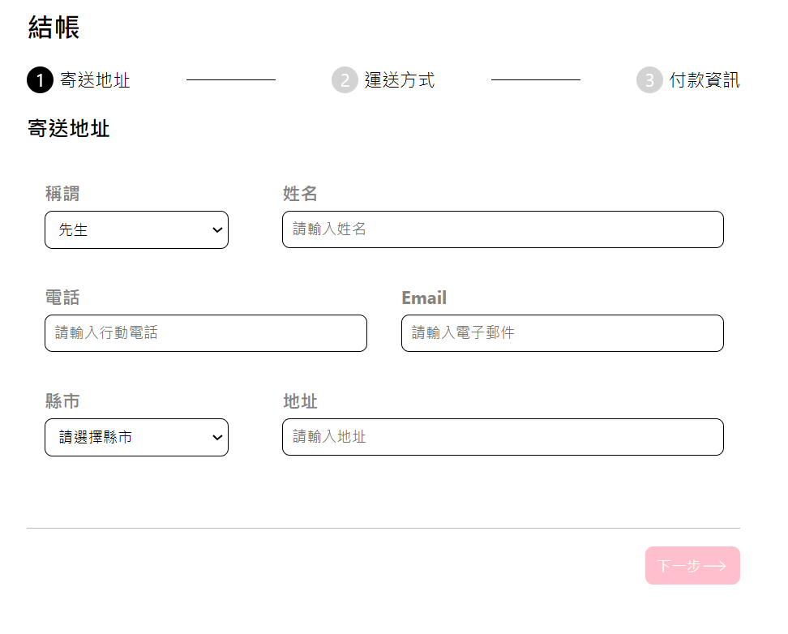

## ALPHA Shop

目前僅渲染出 Step1 的畫面，但已經先將未來會建立的 components 預留資料夾。
目前建立的組件由大到小為：
App -> Step -> StepProgress, Step1, ProgressControl, PrevButton。
### 專案開啟
1. 複製專案
```
git clone https://github.com/ChungYingHo/ALPHA-shop.git
```
2. 進入專案路徑
```
cd ALPHA-shop
```
3. 安裝套件
```
npm install
```
4. 啟動專案
```
npm start
```
5. 前往 **http://localhost:3000** 查看網頁