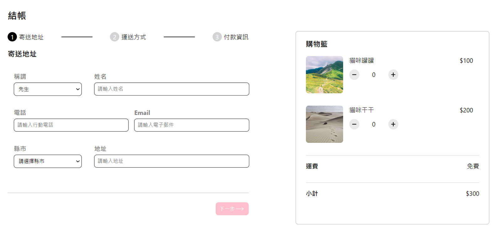

## ALPHA Shop

按照進度，目前渲染出header, step1, cart, footer。待完成部分：
* 換頁邏輯
* 購物車商品數量與總額變動邏輯
### 專案開啟
1. 複製專案
```
git clone https://github.com/ChungYingHo/ALPHA-shop.git
```
2. 進入專案路徑
```
cd ALPHA-shop
```
3. 安裝套件
```
npm install
```
4. 啟動專案
```
npm start
```
5. 前往 **http://localhost:3000** 查看網頁