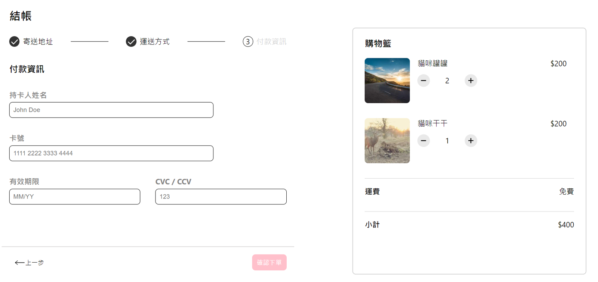

## ALPHA Shop

目前已完成：
* Step1 - 3 的換頁邏輯與渲染。
* 調整前一版的購物車狀態，改成由 Context 管理。

預計新增：
* 黑夜模式。
* 詳細表單驗證。
### 專案開啟
1. 複製專案
```
git clone https://github.com/ChungYingHo/ALPHA-shop.git
```
2. 進入專案路徑
```
cd ALPHA-shop
```
3. 安裝套件
```
npm install
```
4. 啟動專案
```
npm start
```
5. 前往 **http://localhost:3000** 查看網頁